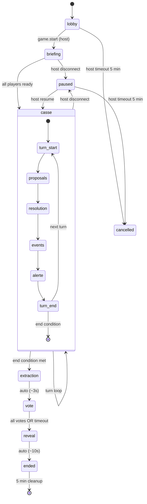

# Spec — Machine à états du serveur de partie

> Réf : F11 (cloud-only), F17 (serveur source de vérité), D7 amendée (server-side store).
> Issue : [#61](https://github.com/leonardtwelve/MultiLines/issues/61).
> Couplée à : `protocole.md` (#60), `store-projection.md` (#63).
> Statut : v1 — 20 mai 2026.

Cette spec décrit la **machine à états globale** d'une partie côté serveur. C'est elle qui :
- détermine quelles actions sont autorisées à chaque instant ;
- pilote les transitions automatiques (fin de tour, fin d'acte) ;
- gère les déconnexions et leurs effets ;
- diffuse les events appropriés (cf. #60).

Elle est **agnostique de l'aventure** dans sa structure générale (actes, tours, validation), mais accepte des **hooks** spécifiques à chaque aventure (résolution d'actions, déclenchement d'événements de tour, etc.).

---

## 1. Modèle d'état

### 1.1. État global d'une room

```ts
type RoomStatus =
  | 'lobby'        // Joueurs rejoignent, Host n'a pas lancé
  | 'briefing'     // Acte 1 : distribution rôles, objectifs, plan
  | 'casse'        // Acte 2 : tours d'actions sur le plateau
  | 'extraction'   // Transition vers le vote
  | 'vote'         // Acte 3 : vote secret (smartphone)
  | 'reveal'       // Révélation publique des résultats
  | 'ended'        // Bilan final
  | 'paused'       // Pause (Host déconnecté ou paused volontaire)
  | 'cancelled';   // Annulée (timeout host, error fatale)
```

Le statut courant est porté par la `Room` (cf. `packages/server/src/core/Room.ts`).

### 1.2. Sous-état au sein de `casse`

L'acte central « casse » est lui-même une boucle de tours. Chaque tour passe par :

```
turn-start  →  proposals  →  resolution  →  events  →  alerte  →  turn-end
```

- `turn-start` : serveur émet `turn.started`, marque le joueur actif, optionnellement démarre un timer.
- `proposals` : phase où le Player actif peut envoyer `action.propose` (ou le serveur attend des propositions parallèles selon le design — voir §1.3).
- `resolution` : serveur applique les actions reçues dans l'ordre déterministe.
- `events` : événements de tour aléatoires/scriptés (cf. spec #25 Banque Lune).
- `alerte` : mise à jour de la jauge d'alerte.
- `turn-end` : émet `turn.ended` puis re-déclenche `turn-start` pour le tour suivant.

### 1.3. Sériel vs simultané
Pour le MVP Banque Lune (G6, G8) : **tours séquentiels**, un joueur actif à la fois. Le sous-état `proposals` n'attend qu'**une** proposition (celle du joueur actif). Les Pactes et votes sont des messages parallèles tolérés à tout moment dans `casse`/`vote`.

Une variante simultanée (tous proposent en parallèle, résolution batchée) pourrait être ajoutée plus tard pour d'autres aventures — l'API state machine est prévue pour le supporter (cf. §3 hooks `expectedProposers`).

---

## 2. Diagramme de transitions

```
                          room.create
                              │
                              ▼
                         ┌────────┐
            ┌─── all left ┤ lobby  │
            │            └────┬───┘
            │                 │ game.start (Host) + ≥3 joueurs
            │                 ▼
            │            ┌──────────┐
            │   error    │ briefing │ ── role distribution, private objective reveals
            │  ◄──────── └────┬─────┘    (privates ciblés par socket)
            │                 │ all-acks OR briefing.complete (button "prêt"
            │                 │                                de chaque joueur)
            │                 ▼
            │            ┌──────────┐  loop: turn-start → proposals → resolution
            │            │  casse   │        → events → alerte → turn-end
            │            └────┬─────┘
            │                 │ (max turns reached) OR (success/fail condition)
            │                 ▼
            │            ┌────────────┐
            │            │ extraction │ ── courte transition (animation, bilan partiel)
            │            └────┬───────┘
            │                 │
            │                 ▼
            │            ┌──────┐
            │            │ vote │ ── tous les joueurs émettent `vote.cast`
            │            └──┬───┘
            │               │ all votes received OR timeout
            │               ▼
            │            ┌────────┐
            │            │ reveal │ ── révélation publique (animée côté Host)
            │            └────┬───┘
            │                 │
            │                 ▼
            │            ┌───────┐
            └───────────►│ ended │
                         └───┬───┘
                             │
                             ▼
                       room deleted

  ┌──────────────────────────────────────────────────────┐
  │ Depuis tout état actif (briefing/casse/extraction/   │
  │ vote/reveal), `game.pause` (Host) → `paused`.        │
  │ `game.resume` (Host) → état précédent.                │
  │ `game.cancel` ou `host.timeout` → `cancelled`.        │
  └──────────────────────────────────────────────────────┘
```

---

## 3. Table des transitions

Notation : `EVENT(payload?) [guard] → newState [side effects]`.

### 3.1. Depuis `lobby`

| Event | Guard | New state | Side effects |
|---|---|---|---|
| `room.join` (Player) | room not full | `lobby` (self-transition) | + player, broadcast `player.joined` |
| `room.leave` (Player) | — | `lobby` | - player, broadcast `player.left` |
| `disconnect` (Player) | grace window 2 min | `lobby` (logiquement, garde le slot) | start grace timer ; broadcast `player.disconnected` (priv) |
| `disconnect` (Player) | grace expirée | `lobby` | - player, broadcast `player.left` |
| `disconnect` (Host) | grace 30 s | `lobby` | start host timer |
| `disconnect` (Host) | grace expirée | `cancelled` | broadcast `game.ended` reason=`host-timeout` |
| `game.start` (Host) | players ∈ [3, 5] ET hostSocket connecté | `briefing` | distribute roles + objectives ; broadcast `game.started` ; dirigés `private.role-revealed`, `private.objective` |
| `game.start` (Host) | players < 3 | reject | `private.error` code=`ROOM_STATE_INVALID` |

### 3.2. Depuis `briefing`

| Event | Guard | New state | Side effects |
|---|---|---|---|
| `briefing.ready` (Player) | player in room | `briefing` | track ready set ; broadcast `briefing.ready-changed` |
| All ready | — | `casse` | broadcast `act.started` payload `{ act: 1 → 2 }` ; enter `casse.turn-start` |
| `disconnect` (Player) | grace 2 min | `briefing` | start grace ; `private.error` aux autres si nécessaire |
| `disconnect` (Host) | grace 30 s | `paused` | broadcast `game.paused` |

### 3.3. Depuis `casse` (sous-machine)

Sous-états (composite) :

| Sub-state | Trigger arrivée | Trigger sortie |
|---|---|---|
| `turn-start` | Entrée dans `casse` ou fin du tour précédent | Auto-transition immédiate ou attente timer |
| `proposals` | `turn-start` complete | Reception `action.propose` du joueur actif (séquentiel MVP) |
| `resolution` | Action proposée valide | Calcul appliqué, `action.resolved` émis |
| `events` | Résolution OK | Aventure produit zéro ou plusieurs `TurnEvent` |
| `alerte` | Events appliqués | Jauge mise à jour, `alert.changed` broadcast si delta |
| `turn-end` | Tous les sous-états passés | Auto → `turn-start` du tour suivant OU sortie vers `extraction` |

Messages reçus dans `casse` (n'importe quel sous-état) :

| Event | Guard | Action |
|---|---|---|
| `action.propose` | sub-state == `proposals` ET sender == active player ET action valide | sub-state → `resolution` |
| `action.propose` | autre | reject `NOT_YOUR_TURN` ou `ROOM_STATE_INVALID` |
| `move.tile` | sub-state == `proposals` ET sender == active player ET tile walkable ET dans portée | apply ; broadcast `player.position-changed` ; **ne consomme PAS le tour** |
| `pacte.propose` | sender ∈ room | accepte ; émet `private.pacte-proposed` à la cible |
| `pacte.respond` | sender = target d'un pacte en attente | applique le pacte ou annule ; broadcast `pacte.resolved` |

Conditions de sortie de `casse` :

| Condition | Évalue après | New state |
|---|---|---|
| `turnNumber > maxTurns` | `turn-end` | `extraction` |
| `alerte ≥ threshold` (Banque Lune) | `alerte` | `extraction` (échec) |
| Tous les objectifs publics complétés | `resolution` | `extraction` (succès anticipé) |
| Aucun joueur restant (déco massive) | `turn-end` | `cancelled` |

#### Précédence quand plusieurs conditions sont vraies simultanément

L'ordre d'évaluation est **fixe et documenté** pour éviter tout comportement non déterministe. À chaque sous-état où une condition peut être évaluée, on parcourt **dans cet ordre** et on s'arrête à la première qui matche :

1. **`cancelled` par déco massive** (≤ 0 joueurs connectés) — toujours en premier, neutralise tout le reste.
2. **`extraction` par échec** (`alerte ≥ threshold`) — l'échec catastrophique l'emporte sur la victoire (sinon on aurait un finish "succès in extremis" qui contredirait le narratif Banque Lune).
3. **`extraction` par succès anticipé** (`objectifs publics complétés`) — récompense l'efficacité avant épuisement des tours.
4. **`extraction` par limite de tours** (`turnNumber > maxTurns`) — finish par timeout (le plus tardif).

Le payload de `game.ended` indique systématiquement `endReason: 'host-timeout' | 'massive-disconnect' | 'failure-alert' | 'success-early' | 'turn-limit'` pour que la UI bilan puisse adapter son rendu.

> **Conséquence sur l'impl** : un même tour peut produire à la fois `alerte ≥ threshold` (en sous-état `alerte`) et `objectifs complétés` (en sous-état `resolution`) — l'échec gagne. Tests à écrire pour ce cas.

### 3.4. Depuis `extraction`

Courte transition (~3-5 s côté UI). Aucune action joueur acceptée. Auto-transition vers `vote` (acte 3).

### 3.5. Depuis `vote`

| Event | Guard | Action |
|---|---|---|
| `vote.cast` (Player) | sender ∈ room ET pas encore voté | record ; broadcast `vote.received` (sans contenu, juste count) |
| Tous les votes reçus OR timeout (60 s) | — | calcule résultats → `reveal` |

### 3.6. Depuis `reveal`

Animation côté Host. Aucun input joueur. Auto-transition `ended` après ~10 s ou click Host `reveal.next`.

### 3.7. Depuis `ended`

État terminal côté logique. Le serveur garde la room en mémoire **5 min** (consultation du bilan via reconnexion) puis la supprime.

| Event | Guard | Action |
|---|---|---|
| `room.leave` (n'importe qui) | — | retire ; quand tous partis, room nettoyée immédiatement |
| Timer 5 min écoulé | — | `RoomRegistry.deleteRoom(id)` |

### 3.8. `paused` ↔ état précédent

`paused` est une **enveloppe** qui stocke l'état pré-pause :

```ts
interface PausedSnapshot {
  previousStatus: RoomStatus;
  pausedAt: Date;
  reason: 'host-disconnect' | 'manual';
}
```

À `game.resume` (Host) ou Host reconnecté avant timeout → on restaure `previousStatus`.

---

## 4. Validations runtime par message

Le serveur valide **avant** d'appliquer (cf. §5 protocole.md anti-triche). Tableau récapitulatif des validations contextuelles :

| Message | Pré-conditions |
|---|---|
| `room.create` | aucune (Host crée toujours) |
| `room.join` | room exists, status=`lobby`, room not full, playerName non vide |
| `room.leave` | sender ∈ room |
| `game.start` | sender = host, status=`lobby`, ≥ 3 joueurs |
| `game.pause` | sender = host, status active (pas `lobby`/`ended`/`cancelled`/`paused`) |
| `game.resume` | sender = host, status=`paused` |
| `game.cancel` | sender = host |
| `action.propose` | status=`casse`, sub-state=`proposals`, sender = active player, actionId ∈ role.capabilities, ressources suffisantes, cible valide |
| `move.tile` | status=`casse`, sub-state=`proposals`, sender = active player, tile walkable, dans portée |
| `pacte.propose` | status=`casse`, sender ∈ room, target ∈ room, target ≠ sender |
| `pacte.respond` | sender = target d'un pacte en attente, pacte pas expiré |
| `vote.cast` | status=`vote`, sender ∈ room, sender pas encore voté |
| `briefing.ready` | status=`briefing`, sender ∈ room |
| `ping` | toujours OK |

Toute violation → `private.error` (ciblé sender) ou `action.rejected` (si rattachable à un `proposalId`).

---

## 5. Lifecycle et déconnexions

### 5.1. Player

```
   connected ──── socket disconnect ────► disconnected (grace 120 s)
       ▲                                       │
       │                                       ▼
       └────────── reconnect <120 s ──────── (still in room)
                                               │
                                               │ grace expired
                                               ▼
                                          left (player.left broadcast)
```

Pendant la grace :
- Le state du joueur reste actif (rôle, objectifs, position, ressources).
- Les autres voient son statut via `player.disconnected` (event pub si en partie).
- Si c'est son tour et qu'il ne revient pas → après 60 s **dans le tour**, le serveur applique une action `pass` automatique (no-op) pour ne pas bloquer.

### 5.2. Host

```
   connected ──── socket disconnect ────► host-disconnected
       ▲                                       │ → status: paused (broadcast game.paused)
       │                                       │
       └─── reconnect <300 s ──────────────────┤ resume previous status
                                               │
                                               │ grace expired (300 s)
                                               ▼
                                          status: cancelled (game.ended host-timeout)
```

### 5.3. Single Player restant

Si pendant `casse` il ne reste qu'un joueur (ou aucun) connecté :
- Au lieu d'annuler, le serveur passe en `paused` reason=`single-player` et attend.
- Si plus personne après `PLAYER_RECONNECT_GRACE_MS` (2 min) → `cancelled`.

---

## 6. Persistance

### 6.1. M2 — RAM only
- `RoomRegistry` en mémoire (déjà livré Prompt 2a).
- Pas de sauvegarde disque, pas de Redis.
- Single-instance Fly.io (cf. F18, F21 implications).
- **Conséquence assumée** : redémarrage serveur = parties en cours perdues. OK pour le MVP playtest.

### 6.2. Future (post-M2)
- Migration vers Redis si multi-instance.
- Sérialisation de l'état de room (toJSON) déjà préparable maintenant — c'est plain JSON-able (tiles[], doors[], players Map → object).
- Sauvegarde optionnelle d'historique des parties (Postgres / Neon) pour stats — pas avant M5+.

---

## 7. Implémentation cible

### 7.1. Architecture proposée

```
packages/server/src/core/
  ├── Room.ts                       # Existant — données pures
  ├── RoomRegistry.ts                # Existant
  └── state-machine/
      ├── RoomStateMachine.ts        # NEW — orchestrateur
      ├── statuses.ts                # NEW — type RoomStatus + constants
      ├── reducers/
      │   ├── lobby.ts               # Transitions depuis lobby
      │   ├── briefing.ts
      │   ├── casse.ts               # Sous-machine de tours
      │   ├── vote.ts
      │   └── reveal.ts
      ├── validators.ts              # Validations runtime par message
      └── hooks.ts                   # Hooks aventure (résolution, events de tour)

packages/server/src/handlers/
  ├── HostHandlers.ts                # Existant — étendu avec game.* commands
  ├── PlayerHandlers.ts              # Existant — étendu avec action.*, vote.*, pacte.*
  └── DisconnectHandlers.ts          # Existant — étendu avec graces (Player 120 s, Host 300 s)
```

### 7.2. Pseudocode du reducer central

```ts
class RoomStateMachine {
  constructor(private room: Room, private hooks: AdventureHooks) {}

  /**
   * Point d'entrée unique. Reçoit un message déjà désérialisé,
   * valide, applique, émet les events.
   */
  handle(msg: ClientRequest, sender: PlayerOrHost): Reaction {
    // 1. Validation contextuelle (cf. §4)
    const error = validate(msg, this.room, sender);
    if (error) return { kind: 'reject', error };

    // 2. Transition selon (status, msg.type)
    const reducer = pickReducer(this.room.status, msg.type);
    const result = reducer.apply(this.room, msg.payload, sender, this.hooks);

    // 3. Side effects à propager (state.patch, broadcasts, ciblés)
    return { kind: 'accept', patches: result.patches, emits: result.emits };
  }

  /** Tick périodique (timers, grace expirées, deadline de tour). */
  tick(now: Date): Reaction[] {
    // Appelle pickTickReducer(status) qui vérifie les timers en cours
  }
}

interface Reaction {
  kind: 'accept' | 'reject';
  patches?: StatePatch[];
  emits?: Array<{ to: 'room' | { socketId: string }; type: string; payload: object }>;
  error?: ErrorPayload;
}

interface AdventureHooks {
  resolveAction(actionId: string, params: unknown, state: GameState): ActionResult;
  triggerTurnEvents(state: GameState): TurnEvent[];
  computeFinalScore(state: GameState): FinalScore;
  // …
}
```

### 7.3. Tests
- Tests unitaires par reducer (lobby, briefing, casse turn-loop, vote).
- Tests scénarios bout-en-bout (lancement partie 3 joueurs → 5 tours → vote → reveal → ended).
- Tests de robustesse (déconnexion Player en plein tour, déconnexion Host pendant briefing, etc.).
- Tests de validation (chaque code d'erreur a son test).

---

## 8. Diagramme synthétique (Mermaid)



---

## 9. Hors scope de cette spec

- Le **détail des règles Banque Lune** par tour (jauge d'alerte, événements, butin) — cf. #25, #27.
- Le **format précis des patches** côté projection — cf. #63.
- Les **animations Host** pendant `reveal` — UX à valider en playtest.
- Le **versioning de partie** post-restart — non couvert (RAM only au MVP).

---

## Annexe — Décisions clés

| # | Décision | Pourquoi |
|---|---|---|
| S1 | États globaux + sous-machine `casse` | Lisibilité ; aventures futures auront leur propre sous-machine d'acte 2 |
| S2 | Tours **séquentiels** (1 joueur actif) | Cohérent G6 Banque Lune ; généralisable en simultané plus tard |
| S3 | RAM only au MVP | Cohérent F17 + simplicité Fly.io single-instance |
| S4 | Grace 120 s Player / 300 s Host | Compromis : long pour playtest mais évite parties zombies |
| S5 | `paused` = enveloppe avec previousStatus | Restauration triviale sans dupliquer la logique |
| S6 | Auto-`pass` après 60 s d'inactivité du joueur actif | Évite parties bloquées si quelqu'un raccroche |
| S7 | Hooks aventure (resolveAction, triggerTurnEvents…) | Découple state-machine générique vs règles spécifiques |
| S8 | Précédence fixe des conditions de sortie `casse` | Évite le non-déterminisme quand échec+succès+timeout coïncident (échec > succès > timeout) |
